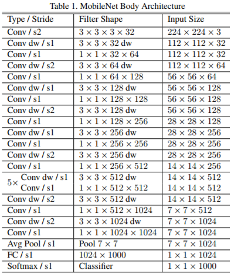

# Traffic Light Image Classification  
Udacity Self-Driving Car Nanodegree  
Capstone Project. System Integration  

#### Overview  
As part of the perception subsystem the car should classify the color of traffic lights on it's way.  
In the given simulator and test site environment car faces single traffic light or a set of 3 traffic lights in the same state (green, yellow, red). We assume it's not possible to have multiple traffic lights in the different states at the same time.

We've considered different approaches to solve the traffic ligth classification task:
*  classification of the entire image using CNN; 
*  object (traffic light in state) detection;  
*  object (traffic light) detection and classification using separate model.  

Considering the fact, that traffic lights are always in the same state, and focusing on the creating of the ligth and fast model, we've chosen the way of the entire image classfication.  
This approach assumes usage of the Convolutional Neural Network, which takes the entire image from the frontal camera as an input and outputs the traffic ligth state (we've decided to use Red / Non-red prediction classes) as an output. We've used transfer learning with MobileNets model, available as Tensorflow image retrain example. 

## Dataset  
There are multiple datasets, available for model training:  
*  images from the Udacity Simulator (images as well as the ground truth from the frontal camera are available as a ROS topic);  
https://drive.google.com/open?id=0Bw5abyXVejvMci03bFRueWVXX1U
*  rosbag, captured on the Udacity's test site;  
https://drive.google.com/file/d/0B2_h37bMVw3iYkdJTlRSUlJIamM/view  
*  Bosch Small Traffic Lights Dataset.  
We've trained our model on a mixture of the datasets above.  

## Image pre-processing
On the image pre-processing step we've applied multiple visual transformations:  
random cropping of the image;  
rotation on the random angle (+/- 5 degrees);  
random flipping of the up to 20% images;  
random color jittering;  
applying shadows (reference: https://goo.gl/VzoxcY).  
In order to slightly balance dataset, some images (manually chosen) were augmented.  
  
## Neural Network Model
"Simple transfer learning with MobileNets model" example from Tensorflow was used to re-train our model.  
We took a MobileNets model, pre-trained on the ImageNet images, and trained a new set of fully connected layers with dropout, which can recognize our traffic light classes of images.   
Model works with the image's dimension 224x224x3, the top layer receives as input a 1001-dimensional for for each image. 


MobileNets are neural networks constructed for the purpose of running very efficiently (high FPS, low memory footprint) on mobile and embedded devices. MobileNets achieve this with 3 techniques:
1.  Perform a depthwise convolution followed by a 1x1 convolution rather than a standard convolution. The 1x1 convolution is called a pointwise convolution if it's following a depthwise convolution. The combination of a depthwise convolution followed by a pointwise convolution is sometimes called a separable depthwise convolution.  
2.  Use a "width multiplier" - reduces the size of the input/output channels, set to a value between 0 and 1.  
3.  Use a "resolution multiplier" - reduces the size of the original input, set to a value between 0 and 1.  
These 3 techiniques reduce the size of cummulative parameters and therefore the computation required. Of course, generally models with more paramters achieve a higher accuracy. MobileNets are no silver bullet, while they perform very well larger models will outperform them. MobileNets are designed for mobile devices, NOT cloud GPUs. The reason we're using them in this lab is automotive hardware is closer to mobile or embedded devices than beefy cloud GPUs.[1]

Accuracy on the simulator data: 

  
Accuracy on the Udacity's test track data: 


## Usage
### Train 

```
nohup python src/retrain.py \
--image_dir data/udacity_data \
--summaries_dir model/summaries_udacity \
--flip_left_right 5 \
--random_crop 5 \
--random_scale 5 \
--random_brightness 5 \
--architecture 'mobilenet_1.0_224'> model/train.log 2>&1 &
```

### Tensorboard

```
nohup tensorboard --logdir model/summaries_udacity > model/tensorboard.log 2>&1 &
```

## Source
1. Udacity Object Detection Lab
