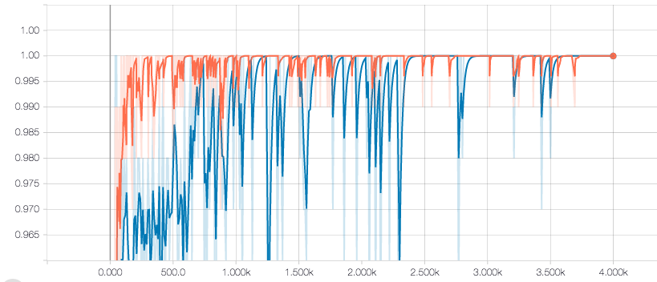
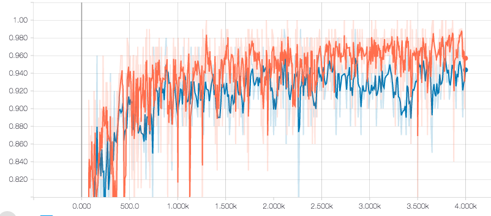

# Traffic Light Image Classification  
Udacity Self-Driving Car Nanodegree  
Capstone Project. System Integration  

## Dataset
### Simulator 
https://drive.google.com/open?id=0Bw5abyXVejvMci03bFRueWVXX1U
  
### Udacity's test track
https://drive.google.com/file/d/0B2_h37bMVw3iYkdJTlRSUlJIamM/view  

Accuracy on the simulator data: 

  
Accuracy on the Udacity's test track data: 


## Usage
### Train 

```
nohup python src/retrain.py \
--image_dir data/udacity_data \
--summaries_dir model/summaries_udacity \
--flip_left_right 5 \
--random_crop 5 \
--random_scale 5 \
--random_brightness 5 \
--architecture 'mobilenet_1.0_224'> model/train.log 2>&1 &
```

### Tensorboard

```
nohup tensorboard --logdir model/summaries_udacity > model/tensorboard.log 2>&1 &
```
